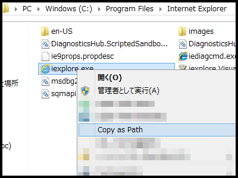
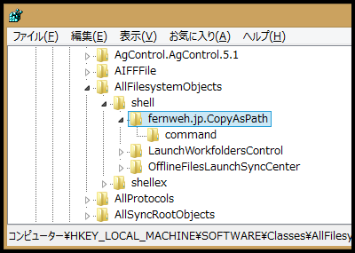

# copy-as-path-in-context-menu-without-shift-key

[Windows] Enable "Copy as Path" in context menu without holding shift key.

Use THIS AT YOUR OWN RIKS.
BACKUP REGISTRY BEFORE INSTALLATION.



## License

Copyright (c) 2015 http://fernweh.jp/  
MIT License, see [LICENSE](LICENSE).

## Installation

BACKUP REGISTRY BEFORE INSTALLATION.
Run setup.vbs to insatll.

```
git clone git@github.com:fernweh8000/copy-as-path-in-context-menu-without-shift-key.git
cd copy-as-path-in-context-menu-without-shift-key
setup.vbs
```

## Uninstallation (manually)

BACKUP REGISTRY BEFORE UNINSTALLATION.

1. Delete registry key  
```
reg delete HKEY_LOCAL_MACHINE\SOFTWARE\Classes\AllFilesystemObjects\shell\fernweh.jp.CopyAsPath
```
<br/>
2. Delete directory "%LocalAppData%/fernweh.jp/c-c/"
```
rmdir /S "%LocalAppData%/fernweh.jp/c-c/"
```
